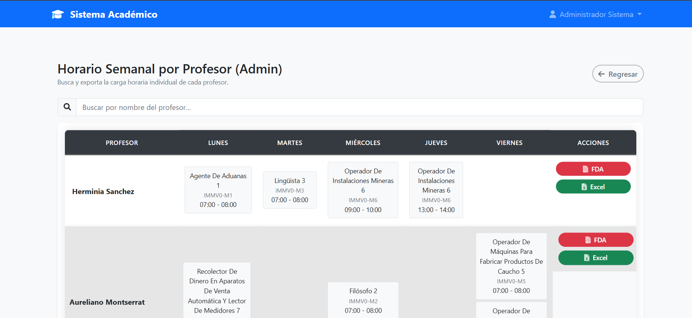
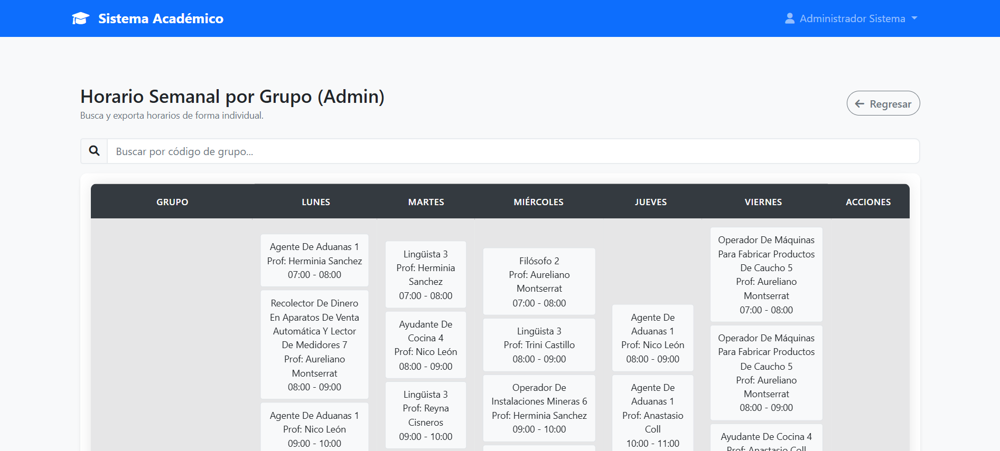

# Sistema de Gestión de Horarios Escolares 📅🎓

> **Proyecto:** Plataforma web para la generación y visualización de cargas académicas.
> **Modalidad:** Colaboración (Equipo de Desarrollo).
> **Mi Rol:** Desarrollo del Módulo de Visualización, Reportes y Filtros por Rol.

## 📖 Descripción del Proyecto
Este sistema automatiza la gestión de horarios para una institución educativa, permitiendo cruzar disponibilidad de profesores, aulas y grupos.

Mi contribución se centró en el **Front-End y la Lógica de Presentación (Backend)**. Fui el encargado de traducir los datos crudos de la base de datos en interfaces visuales comprensibles (Horarios Semanales) y en herramientas de exportación para la administración.

---

## 👁️ Módulos Desarrollados por Mí

### 1. Visualización de Horarios (Admin y Jefes de Carrera)
Desarrollé las vistas que renderizan la matriz de horarios.
* **Lógica de Negocio:** Implementé filtros de seguridad para que los "Jefes de Carrera" solo puedan visualizar los grupos pertenecientes a su departamento, mientras que el Administrador tiene visión global.
* **UX:** Diseño de tablas responsivas que organizan las materias por día y bloque horario.

| Vista por Profesor | Vista por Grupo |
|:---:|:---:|
|  |  |

### 2. Generación de Reportes y Exportación
Implementé la funcionalidad para transformar las vistas HTML en documentos descargables oficiales.
* **Botones de Acción:** Integración de librerías para generar reportes en **PDF** (para impresión oficial) y **Excel/CSV** (para manipulación de datos).

---

## 🛠 Stack Tecnológico
* **Backend:** Python con **Flask** (Micro-framework).
* **Base de Datos:** SQLite (Ligera y eficiente para gestión académica local).
* **Frontend:** Jinja2 Templates, CSS3, JavaScript.
* **Herramientas:** Generación de PDFs y manipulación de archivos CSV.

---

### 📬 Contacto
